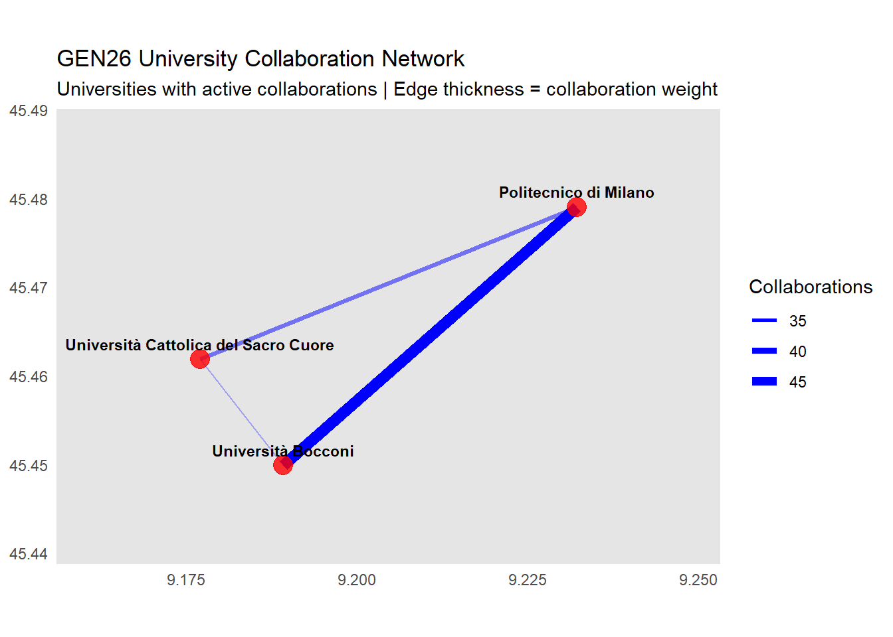
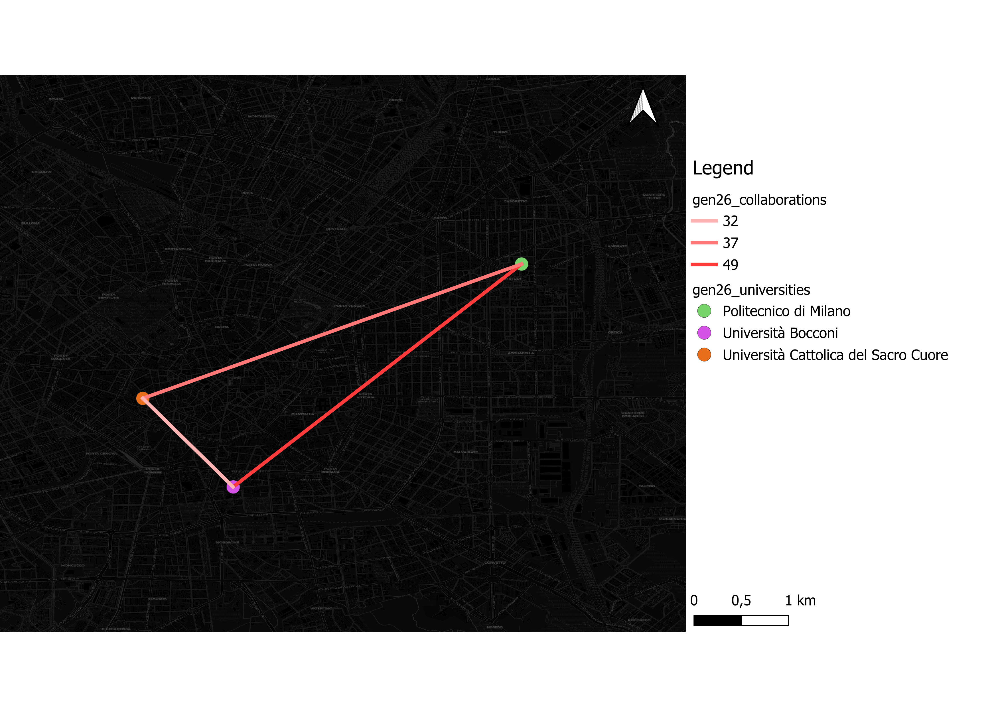
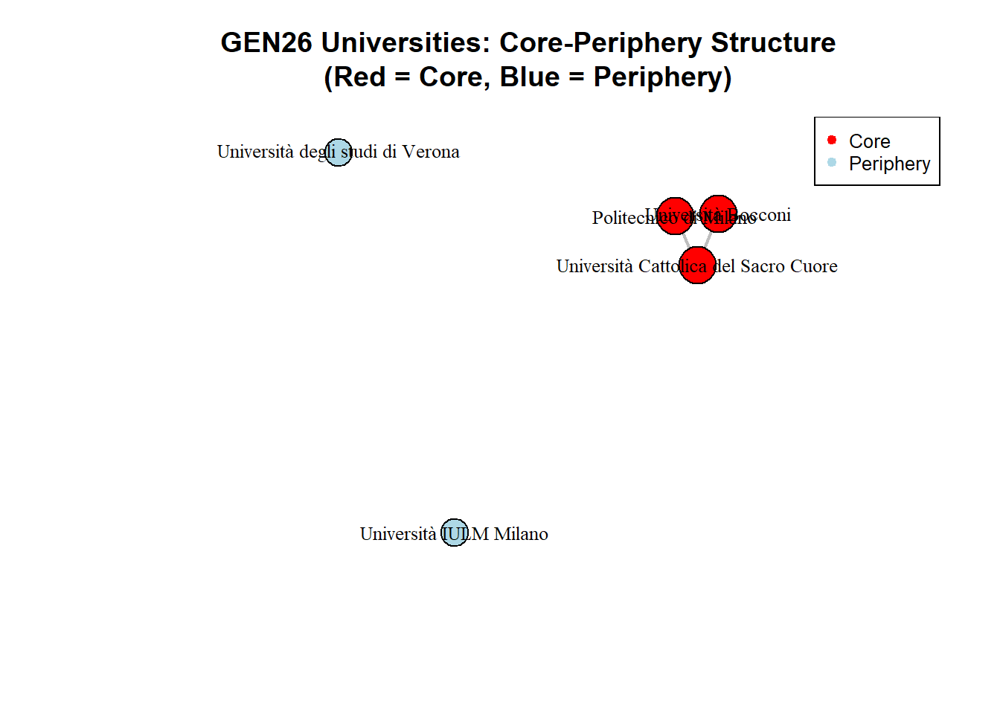
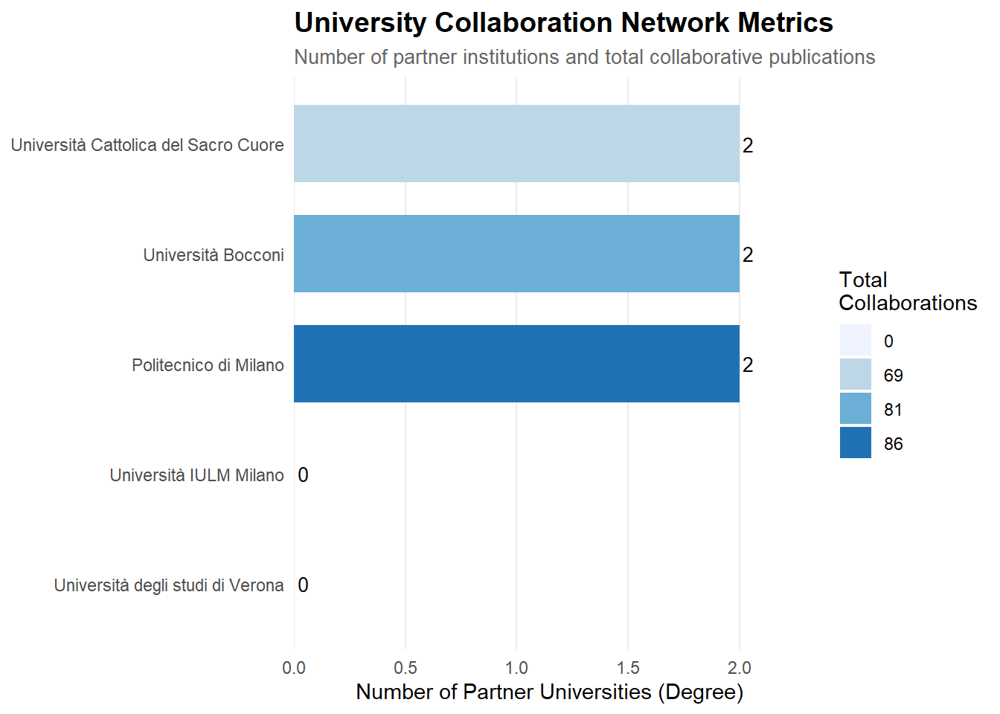

# SNA
Advanced R and GIS for Spatial Network Analysis - University of Augsburg

# Research Question
"How do the GEN26 participating universities collaborate in scientific research? A spatial network analysis of co-authorship patterns and institutional partnerships (2023-2026)."

# Introduction
On June 24, 2019, Milan received the momentous announcement in Lausanne, Switzerland, that it would host the 2026 Winter Olympics alongside Cortina d'Ampezzo.
This historic decision marked the beginning of a transformative journey that would extend far beyond sports infrastructure and urban development.
 
 
Four years later, in 2023, Milano Cortina 2026 took a significant step toward educational legacy by officially launching the GEN26 program.
This comprehensive educational initiative was announced in collaboration with the Italian Ministry of Education and Merit, CONI (Italian National Olympic Committee), and CIP (Italian Paralympic Committee), with the ambitious goal of building bridges between the educational and youth sectors and the sports movement.
 
 
The GEN26 program has established partnerships with several prestigious Italian universities:
- Università Bocconi
- Università degli studi di Verona
- Università Cattolica del Sacro Cuore
- Università IULM Milano
- Politecnico di Milano
These institutions represent just some of the universities involved in the GEN26 project, with the program's reach extending across Italy through strategic partnerships.

### Collaboration Structure
The collaboration operates through multiple interconnected frameworks:
- **CRUI Foundation Partnership:** Milano Cortina 2026 has established a significant partnership with the CRUI Foundation (Italian Conference of University Rectors), which aims to support dual careers in sports and studies while expanding university education and internship opportunities related to the Games.
- **SDA Bocconi Specialized Programs:** A notable collaboration with SDA Bocconi School of Management has resulted in the creation of the Executive Master in Business of Events (EMBE), a twelve-month program designed to develop expertise in major event management.
- **Dual Career Program:** This initiative involves Fondazione Milano Cortina 2026, CONI, CIP, the Minister of Sports and Youth, and the Ministry of Universities and Research, reinforcing and integrating educational values with amateur sports activities.

### Program Impact and Scope
The GEN26 program has demonstrated remarkable reach since its launch:
- **Over 2 million students** engaged across Italy
- **More than 500,000 young people** involved in various projects
- **More than 1,200 participating schools and youth groups**
- Coverage across **20 regions** and **81 provinces** of Italy

# Methology
Demonstration of end-to-end course pipeline.
### 1. Fetching Scopus API Data
**GET API:**
[https://api.elsevier.com/content/search/scopus?query=(AFFIL('Università Bocconi') OR AFFIL('Università degli studi di Verona') OR AFFIL('Università Cattolica del Sacro Cuore') OR AFFIL('Università IULM Milano') OR AFFIL('Politecnico di Milano'))&"date"="2023-2026"&"view"="COMPLETE"](https://api.elsevier.com/content/search/scopus?query=PUBYEAR%20%3E%202023%20AND%20(AFFIL("Università%20Bocconi")%20OR%20AFFIL("Università%20degli%20studi%20di%20Verona")%20OR%20AFFIL("Università%20Cattolica%20del%20Sacro%20Cuore")%20OR%20AFFIL("Università%20IULM%20Milano")%20OR%20AFFIL("Politecnico%20di%20Milano"))&"date"="2023-2026"&"view"="COMPLETE")
**Python Script for Fetching:**
[Fetch Scopus Python File](harvest_scopus.py) fetches the Data from the GET API shown above.

### 2. Data Preparation
- **Data Cleaning**:
    - filtering out NA/empty values
    - deduplication using distinct() operations
- **Data Extraction**:
    - works_from_chunk(): publication metadata
    - authors_from_chunk(): author information
    - affils_from_chunk(): affiliations information
- **Collaboration Filtering**:
    - check_collaboration(): identifying papers with ≥2 affiliations

### 3. Geocode
- **Address Construction**: paste(affil, city, country, sep = ", ")
- **Geocoding Service**: method = "osm"
- **Coordinate Output**: lat = latitude, long = longitude

### 4. Network Analysis Method
- **Network Construction**:
    - igraph network
    - Nodes: Affilimations
    - Weighted Edges: Collaborative publications between university pairs
- **Borgatti-Everett Core-Periphery Analysis**:
    - Rank-1 approximation with degree centrality
    - Rank-1 approximation with eigenvector centrality
    - Genetic Algorithm

# Basic Network Statistics
- **Nodes: 5** - All GEN26 universities included
- **Edges: 3** - distinct collaboration relationships between these universities
- **Mean Degree: 1.2** - Average collaborations per university (6 total degrees ÷ 5 universities)
- **Median Degree: 1** - Middle value when universities ranked by connections
- **Total Weight: 118** - total collaborative publications across all partnerships
- **Mean Weight: 39.33** - Each collaboration pair produces an average of ~39 joint papers
- **Density: 0.3** - Only 30% of possible connections exist (3 out of 10)
- **Isolated Nodes: 2** - Two universities with no collaborations

| Dimension | Value | Interpretation |
|----------------------|----------------------|----------------------|
| **Scale**     | 5 nodes, 3 edges   | **Medium-sized consortium** with limited active connections |
| **Connectivity**     | Mean: 1.2, Median: 1   | **Low connectivity** - most universities have 0-2 partners |
| **Intensity**     | 39.33 papers/edge   | **Very high intensity** - existing collaborations are extremely productive |
| **Density**     | 0.3 (30%)   | **Sparse network** - 70% of potential collaborations unrealized |

# Results

### GEN26 University Collaboration Network

### QGIS

### Borgatti-Everett Core-Periphery Analysis

### Bar Chart

# Discussion

### Interpretation
• **Quality-over-Quantity Strategy**: The GEN26 network shows only 30% connectivity (3 out of 10 possible partnerships) but achieves exceptional productivity with 39.33 papers per active collaboration, indicating strategic focus on deep, sustained partnerships rather than broad networking

• **Unrealized Collaboration Potential**: With 70% of possible partnerships unexplored and 40% of universities (2 out of 5) remaining isolated from inter-institutional collaboration, the network has significant expansion opportunities

• **Geographic Independence**: Collaboration patterns are driven by research synergy rather than physical proximity - despite three universities being Milan-based, the network structure suggests strategic rather than location-based partnerships

• **Methodologically Robust Classification**: The analysis employs three validation methods (degree centrality, eigenvector centrality, and genetic algorithm) with consensus voting to ensure reliable core-periphery identification, providing trustworthy structural insights

### Limitations

• **Temporal Scope Restriction**: Analysis limited to 2023-2026 publications only, creating a narrow 4-year window that may miss established collaboration patterns and suffer from publication lag effects, particularly for recent 2025-2026 collaborations that may not yet be indexed

• **API Technical Constraints**: Data collection constrained by Scopus API rate limits (maximum 9 requests per second, 10,000 total requests per run), potentially resulting in incomplete data harvesting for highly productive institutions and missing publications due to technical limitations

• **Narrow Institutional Scope**: Analysis restricted to only 5 pre-selected Italian universities with collaboration definition requiring at least 2 target institutions per paper,excluding single-institution research and partnerships with non-GEN26 universities, limiting generalizability

• **Single Database Dependency**: Exclusive reliance on Scopus database may miss publications in non-indexed journals, conference proceedings, local Italian publications, or other academic databases, creating potential coverage gaps in collaboration assessment